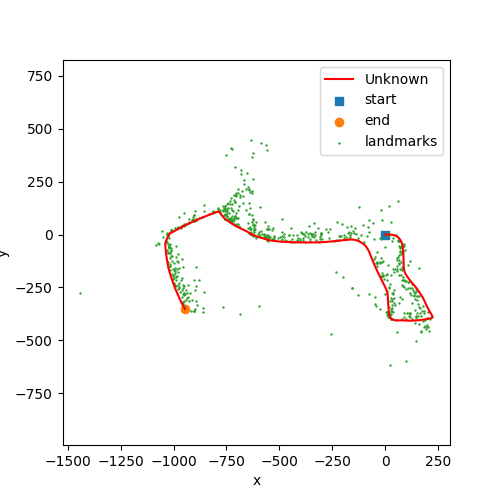

# Visual Inertial SLAM

## Objective:
Implement visual-inertial simultaneous localization and mapping (SLAM) using an extended Kalman filter
(EKF). You are provided with synchronized measurements from an inertial measurement unit (IMU) and
a stereo camera as well as the intrinsic camera calibration and the extrinsic calibration between the two
sensors, specifying the transformation from the left camera frame to the IMU frame.
- The below figures show the deadreckoning trajectory on left and the updated Extended Kalman Filter with landmarks on right.
<div style="display: flex; justify-content: center;">
  
  
</div>

## 

## Code
- Clone the repository
- create virtual environement (anaconda can be used to do it and instructions are given below):
```
conda create --name env_particleSLAM
conda activate env_particleSLAM
pip install -r requirements.txt
```
- utils.py contains all relevant functions required for the main function
- give correct paths in config.yml
- The main.py script generates 3 plots of each:
	- Deadreckoning
	- Landmark Mapping
	- Visual SLAM

